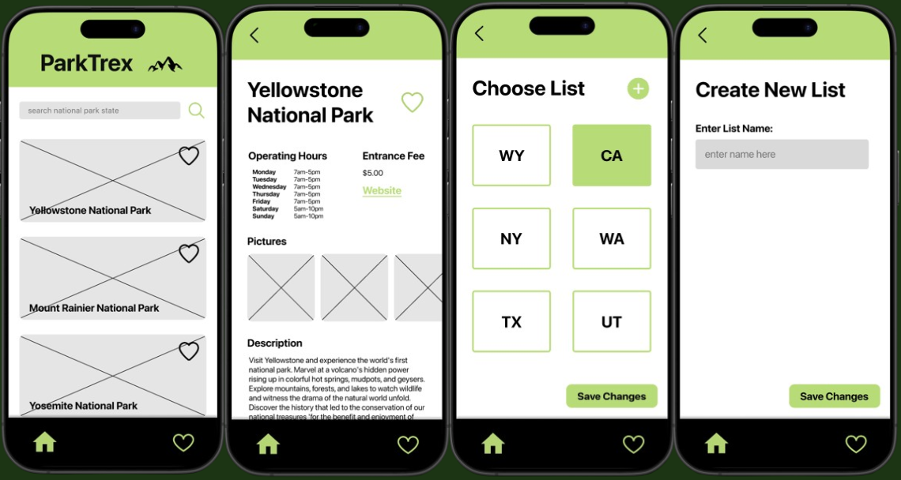
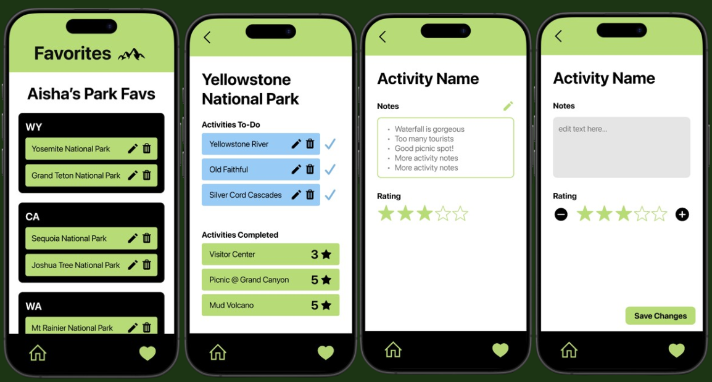

# Final Project: ParkTrex

[Final Presentation Slides](https://docs.google.com/presentation/d/1o5-P0sfJUVaH5G-G5PlmSS4tWpR734ljOtk9b1ctoCY/edit?usp=sharing)

## Pitch
Nature-lovers and outdoor enthusiasts enjoy visiting the magnificent National Parks across the USA. With ParkTrex, users can easily discover national parks by state and create a personalized list of their favorite parks to visit. It lets users track, rate, and share their experiences of the parks they've visited all in one place. Searching by state allows for easier planning for users. They can decide which park to visit when they are in a specific state.

## User Story
"As a national-park-enthusiast, I would like to search up National Parks in the area. I would like to know general information about the park before I add it to my list. I want a self-curated list that stores my visited parks, comments about my experience, and a rating feature so that I can recommend the best parks to my friends and family."

## Developer Checklist
- Setup API for NPS
- Setup JSONServer
- Text input fields for the create/edit screens
- Form binding for create/edit screens, star rating field
- Setup new context for parks and added fields, adding "rating" field
- Use icons for 'Edit' and 'Delete' and make them clickable
- Figma Design
- CRUD capabilities for Park List

## Revised Checklist
- Need hooks for getting all results for a specific state and for getting a specific park's information
- Listener for 'didFocus' on FavoriteScreen
- Try Catch for all ParkContext methods
- Default layout when there are no parks added to list yet

## UI

---

To run this project:

1. Run jsonserver project
- npm run db
- npm run tunnel

2. Run parktrex project
- change ngrok link in src/api/jsonServer
- npm run start

To navigate through project:
1. Landing Page: SearchScreen
2. Search for a state code (e.g. "WA", "WY", "KY", "TX" etc)
3. Click on the first ParkItem
4. ParkViewScreen with specific park information
5. Click on green heart on the top right side to see Favorites List
6. Click on plus button to create a new ParkCard
7. ParkCard will have Edit and Delete icons that are clickable. ParkCard itself is also clickable and will direct to ParkViewScreen