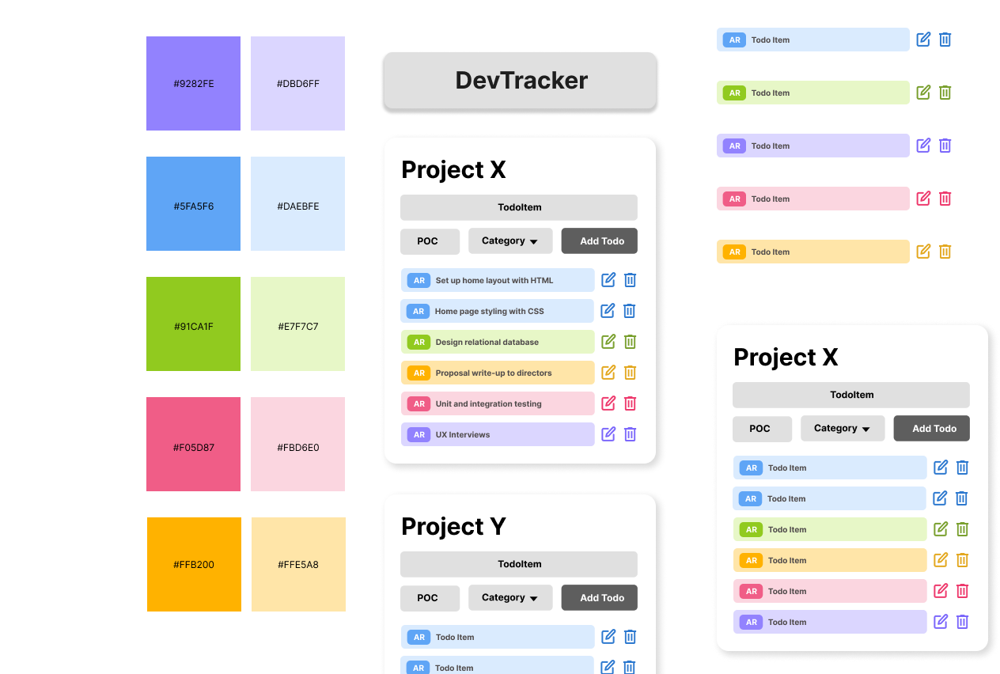
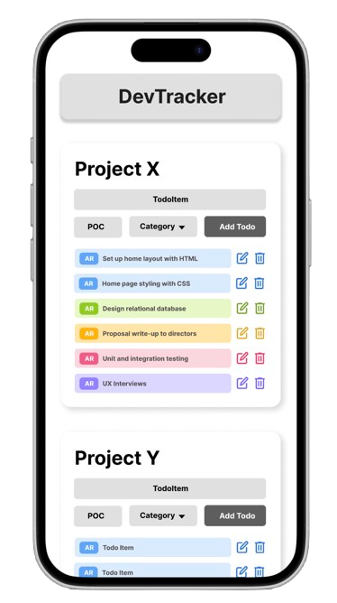

# Midterm Project: DevTracker

[Midterm Presentation Slides](https://docs.google.com/presentation/d/1d7A86Gk4wvde0hkz7pWzTX4RNUNl2lU5NGsFTvJdYJs/edit?usp=sharing)

## Pitch
Software developers and program managers of all levels need a TodoList to keep track of specific tasks for each of their projects. They work not just on 1 project but multiple. Each project has various components involving various skills and tech stacks. The goal of DevTracker is to facilitate task management for developers through color-coded tasks and a person of contact.

## User Story
"As a developer, I would like to Create/View/Edit/Delete my project tasks. As a program manager, I would like to know who's in charge of which task and what category it's a part of. Having a color-coded list of tasks based on category and the person-of-contact for each task can streamline processes and overcome blockers quickly."

## Developer Checklist
- Download all npm dependencies/libraries
- Use icons for 'Edit' and 'Delete' and make them clickable
- Add a new text input field 'POC' and dropdown field 'Category' to my CreateTodo and EditTodo
- The dropdown options are Frontend, Backend, Design, Testing & Deployment, Documentation
- The dropdown will need to have an onChange event listener and a handleChange function.
- Each TodoItem will have a background-color that corresponds to its current category. Conditional classnames will be applied with the help of the library classnames.
- Update my Todo objects to expect the additional keys 'category' and 'poc' in my TodoContext and any instance of the todo within the App.

## Revised Checklist
- Download all npm dependencies/libraries
- Use icons for 'Edit' and 'Delete' and make them clickable
- Add a new text input field 'POC' and dropdown field 'Category' to my CreateTodo and EditTodo
- The dropdown options are Frontend, Backend, Design, Testing & Deployment, Documentation
- The dropdown will need to have an onChange event listener and a handleChange function.
- Each TodoItem will have a background-color that corresponds to its current category. Conditional classnames will be applied with the help of the library classnames.
- Update my Todo objects to expect the additional keys 'category' and 'poc' in my TodoContext and any instance of the todo within the App.
- Update REST API/HTTP (specifically POST and PUT) to accept additional parameters (poc and category)
- Update context for createTodo and editTodoById to send additional parameters in body (poc and category)
- Resetting the new inputs when submitting forms
- Adding local states in TodoCreate for poc and category

## UI

---

# Getting Started with Create React App

This project was bootstrapped with [Create React App](https://github.com/facebook/create-react-app).

## Available Scripts

In the project directory, you can run:

### `npm start`

Runs the app in the development mode.\
Open [http://localhost:3000](http://localhost:3000) to view it in your browser.

The page will reload when you make changes.\
You may also see any lint errors in the console.

### `npm test`

Launches the test runner in the interactive watch mode.\
See the section about [running tests](https://facebook.github.io/create-react-app/docs/running-tests) for more information.

### `npm run build`

Builds the app for production to the `build` folder.\
It correctly bundles React in production mode and optimizes the build for the best performance.

The build is minified and the filenames include the hashes.\
Your app is ready to be deployed!

See the section about [deployment](https://facebook.github.io/create-react-app/docs/deployment) for more information.

### `npm run eject`

**Note: this is a one-way operation. Once you `eject`, you can't go back!**

If you aren't satisfied with the build tool and configuration choices, you can `eject` at any time. This command will remove the single build dependency from your project.

Instead, it will copy all the configuration files and the transitive dependencies (webpack, Babel, ESLint, etc) right into your project so you have full control over them. All of the commands except `eject` will still work, but they will point to the copied scripts so you can tweak them. At this point you're on your own.

You don't have to ever use `eject`. The curated feature set is suitable for small and middle deployments, and you shouldn't feel obligated to use this feature. However we understand that this tool wouldn't be useful if you couldn't customize it when you are ready for it.

## Learn More

You can learn more in the [Create React App documentation](https://facebook.github.io/create-react-app/docs/getting-started).

To learn React, check out the [React documentation](https://reactjs.org/).

### Code Splitting

This section has moved here: [https://facebook.github.io/create-react-app/docs/code-splitting](https://facebook.github.io/create-react-app/docs/code-splitting)

### Analyzing the Bundle Size

This section has moved here: [https://facebook.github.io/create-react-app/docs/analyzing-the-bundle-size](https://facebook.github.io/create-react-app/docs/analyzing-the-bundle-size)

### Making a Progressive Web App

This section has moved here: [https://facebook.github.io/create-react-app/docs/making-a-progressive-web-app](https://facebook.github.io/create-react-app/docs/making-a-progressive-web-app)

### Advanced Configuration

This section has moved here: [https://facebook.github.io/create-react-app/docs/advanced-configuration](https://facebook.github.io/create-react-app/docs/advanced-configuration)

### Deployment

This section has moved here: [https://facebook.github.io/create-react-app/docs/deployment](https://facebook.github.io/create-react-app/docs/deployment)

### `npm run build` fails to minify

This section has moved here: [https://facebook.github.io/create-react-app/docs/troubleshooting#npm-run-build-fails-to-minify](https://facebook.github.io/create-react-app/docs/troubleshooting#npm-run-build-fails-to-minify)
